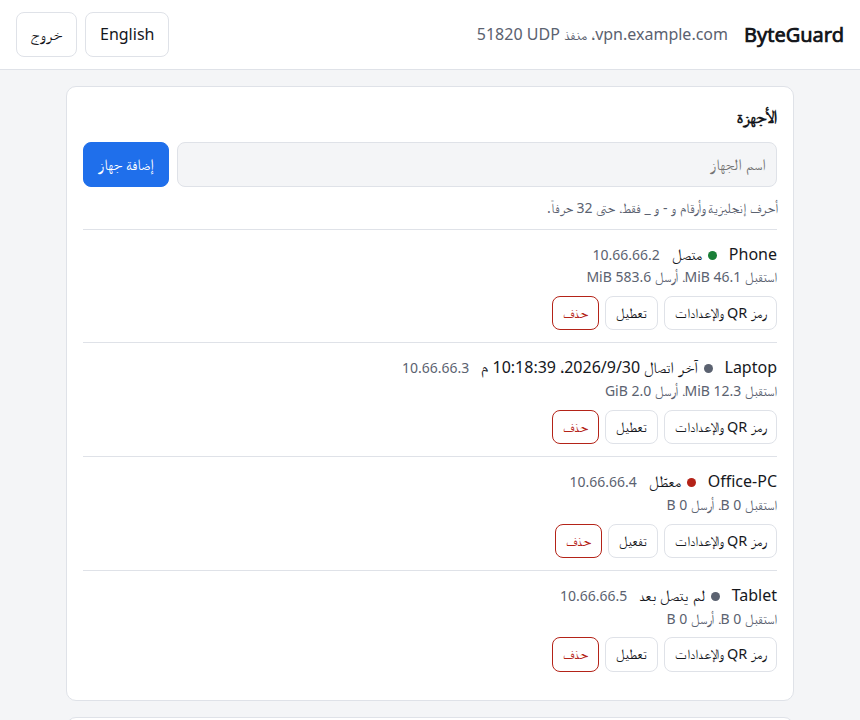

<p align="center">
  
</p>

<div dir="rtl">

# ByteGuard

[English](README.md)

نقدّم لكم ByteGuard لتنصيب خادم WireGuard على خادمكم بأمر واحد، وإدارة أجهزتكم من صفحة ويب، واستعادة إعداداتكم كاملةً من ملف نسخة احتياطية واحد بعد إعادة تثبيت الخادم.

<p align="center">
  
</p>

## التنصيب

على خادم يعمل بنظام Ubuntu 22.04 أو أحدث، أو Debian 12 أو أحدث:

<div dir="ltr">

```bash
curl -fsSL https://bytebalancetech.com/byteguard.sh -o byteguard.sh
sudo bash byteguard.sh
```

</div>

يحوّل هذا العنوان إلى آخر إصدار على GitHub، ويمكنكم التنزيل من GitHub مباشرة:

<div dir="ltr">

```bash
curl -fsSL https://github.com/kenanwahbeh/ByteGuard/releases/latest/download/byteguard.sh -o byteguard.sh
```

</div>

وللتحقق من الملف قبل تشغيله، يمكن مقارنته ببصمة SHA-256 المنشورة مع الإصدار:

<div dir="ltr">

```bash
curl -fsSLO https://github.com/kenanwahbeh/ByteGuard/releases/latest/download/byteguard.sh.sha256
sha256sum -c byteguard.sh.sha256
```

</div>

وقد ضمّنّا البرنامج داخل ملف التنصيب نصاً مقروءاً، فتستطيعون أيضاً قراءته قبل تشغيله.

## ما نقدّمه

- **إعداد موجّه:** نكتشف بطاقة الشبكة المتصلة بالإنترنت وعنوان الخادم العام ونطلب منكم تأكيدهما، ثم نسألكم عن المنفذ (الافتراضي `51820`).
- **تمرّ حركة بيانات أجهزتكم كلها عبر الخادم**، مع `PersistentKeepalive = 25` و `MTU = 1420`.
- **إدارة الأجهزة:** إضافتها وحذفها وتعطيلها مؤقتاً، وعرض رمز QR لأي جهاز في أي وقت، من الطرفية أو من الواجهة.
- **نسخة احتياطية بعد كل تعديل** دون أي إجراء منكم. والنسخة ملف واحد يكفي تشغيله على خادم جديد لتعود الشبكة بالمفاتيح نفسها، وتتصل أجهزتكم دون إعدادات جديدة. نحفظ النسخة في `/var/backups/byteguard/`، ويمكننا إرسالها إلى محادثتكم على Telegram ورفعها إلى تخزين متوافق مع S3 مثل Cloudflare R2.
- **واجهة ويب بالعربية والإنجليزية**، لا تعمل إلا من داخل الشبكة الافتراضية الخاصة (VPN).
- **اختيارياً:** الواجهة على نطاقكم عبر Cloudflare Tunnel دون فتح أي منفذ. ننشئ لها نفقاً خاصاً، ولا نمسّ أي نفق موجود على الخادم.
- **نحترم الجدار الناري القائم:** نضيف قواعد ufw أو iptables دون حذف أي قاعدة موجودة، وعند إزالة التنصيب نحذف ما أضفناه فقط.

يعمل كل شيء على خادمكم وبحساباتكم أنتم. لا نجمع أي بيانات، ولا تخرج مفاتيحكم وأجهزتكم إلا إلى وجهات النسخ الاحتياطي التي تختارونها.

## الأوامر

بعد التنصيب يفتح الأمر `sudo byteguard` قائمةً، والإجراءات نفسها متاحة أوامرَ مستقلة:

| الأمر | الوظيفة |
|---|---|
| `sudo byteguard add NAME` | إضافة جهاز وعرض إعداداته ورمز QR |
| `sudo byteguard show NAME` | عرض إعدادات جهاز ورمز QR مرة أخرى |
| `sudo byteguard list` | قائمة الأجهزة |
| `sudo byteguard status` | الأجهزة المتصلة واستهلاك كل جهاز |
| `sudo byteguard disable NAME` | منع جهاز من الاتصال دون حذفه (`enable` يعيده) |
| `sudo byteguard remove NAME` | حذف جهاز |
| `sudo byteguard port NUMBER` | نقل الشبكة إلى منفذ آخر، ويحتاج كل جهاز بعدها إلى إعداداته من جديد |
| `sudo byteguard ui setup` | تشغيل الواجهة وتعيين كلمة مرورها (`ui off` يوقفها) |
| `sudo byteguard ui tunnel` | الواجهة على نطاقكم عبر Cloudflare (`--off` يوقفها) |
| `sudo byteguard backup` | نسخة احتياطية فورية |
| `sudo byteguard backup telegram` | إرسال كل نسخة إلى Telegram عبر بوت خاص بكم |
| `sudo byteguard backup s3` | رفع كل نسخة إلى R2 أو أي تخزين متوافق مع S3 |
| `sudo byteguard uninstall` | إزالة الشبكة ومفاتيحها و ByteGuard |

## الواجهة

عند تشغيل `sudo byteguard ui setup` نطلب منكم كلمة مرور، ثم نشغّل الواجهة على عنوان الخادم داخل الشبكة، مثل `http://10.66.66.1:51821`. ولا تُفتح إلا من جهاز متصل بالشبكة، إذ لا يجيب العنوان من أي مكان آخر. وإذا أُدخلت ثماني كلمات مرور خاطئة من عنوان واحد، نُقفل الدخول منه خمس دقائق دون أن يتأثر غيره.

ومع `sudo byteguard ui tunnel` تصبح الواجهة متاحة على عنوان مثل `https://vpn.example.com`. يتطلب ذلك نطاقاً في حسابكم على Cloudflare، وتكفي الخطة المجانية. وبعد تفعيلها يستطيع كل من يعرف العنوان الوصول إلى صفحة الدخول، لذا ننصحكم بكلمة مرور قوية، ويُستحسن وضع Cloudflare Access أمامها.

## الاستعادة

لاستعادة الإعدادات يكفي نسخ ملف النسخة الاحتياطية إلى خادم جديد وتشغيله:

<div dir="ltr">

```bash
sudo bash byteguard-backup-NAME.sh
```

</div>

تتصل الأجهزة تلقائياً إذا كان للخادم الجديد العنوان العام نفسه. أما إذا تغيّر العنوان، فيُضاف الخيار `--endpoint NEW_ADDRESS` إلى أمر التشغيل، وعندها يحتاج كل جهاز إلى إعداداته من جديد.

**النسخة الاحتياطية غير مشفّرة.** فهي تحتوي مفتاح الخادم ومفاتيح جميع الأجهزة ورموز Telegram والتخزين، ومن يحصل عليها يستطيع الاتصال بشبكتكم. لذا يجب حفظها، هي والمحادثة والحاوية (bucket)، في مكان خاص. التفاصيل في [SECURITY.md](SECURITY.md).

## الدعم

إن وجدتم المشروع مفيداً، يمكنكم دعم تطويره عبر Binance Pay، بمسح الرمز أدناه من تطبيق Binance أو بالبحث عن الاسم **Kinan125**.

<p align="center">
  
</p>

## الترخيص

MIT، والتفاصيل في ملف [LICENSE](LICENSE).

WireGuard علامة تجارية مسجّلة لـ Jason A. Donenfeld، ومشروعنا ByteGuard مستقل، غير تابع لمشروع WireGuard ولا معتمد منه.

</div>
